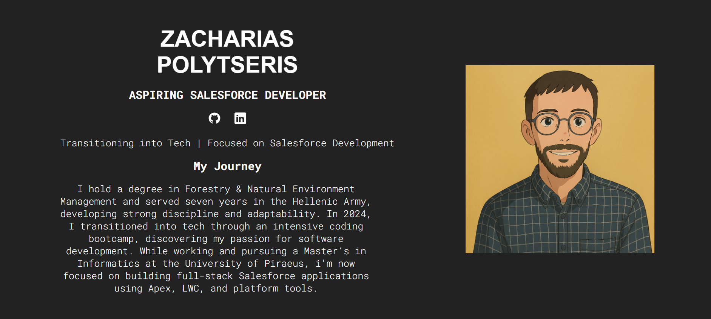

# My Portfolio 

This is a React-based portfolio website showcasing my projects, skills, and experiences. It is built using the modern development stack with Vite for fast builds and optimizations. The website is deployed to GitHub Pages for easy access.

## Features

- Clean, responsive design
- Fast loading times thanks to Vite
- Built using React 18
- Linted with ESLint for consistent code style
- Deployed via GitHub Pages

This portfolio was built with the help of the following tutorial: [How to Become a Developer](https://www.youtube.com/watch?v=ZpIel9cv4Jk&t=7281s). This tutorial helped me get started with React and Vite, two technologies that I’m now confident in using.
